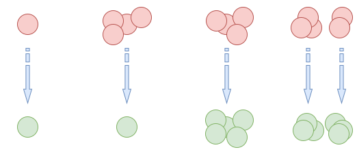
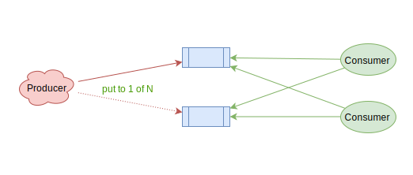

class: first
layout:false


.absolute.width80.left8.top8[
# Queues: usecases

## Mons Anderson
### Mail.Ru Cloud Solutions
]

---
layout:true
# Test

```lua
local x = 1
function test(arg1, arg2)
*   os.execute(...)
    require 'moonlibs' print(...)
    `require 'moonlibs'`
end
```
Some `inline` code with .red[red] and .green[green] text
.not[
```lua
local x = 1
function test(arg1, arg2)
*   os.execute(...)
    require 'moonlibs' print(...)
    `require 'moonlibs'`
end
```
]

---
layout:false

# Queue


---

# Queue

.big[
* FIFO
* LIFO (stack)
* Bidirectional
* Priority
* ...
]

---

# Queue


---

# Distribution


---

# Distribution


---

# Distribution


---

# Distribution



---

# Distribution


---

# Methods


---

# Methods


---

# Publish/subscribe


---

# Publish/subscribe


---
class: center, middle

# Reasons to use

---

# Overload smoothing


---

# Overload smoothing


---

# Overload smoothing


---

# Load balancing


---

# Distributed system viability


---

# Hardware application


---

# Hardware application


---

# Appliances

.left.big[
## Hardware
* IRQ
* Hardware buffers
* Network buffers
* NCQ (prediction)
* ...
]
--
.right[

]

---

# Appliances

.left.big[
## Hardware
* IRQ
* Hardware buffers
* Network buffers
* NCQ (prediction)
* ...
]

.right.big[
## Kernel
* epoll/kqueue
* TCP listen backlog
* read/write buffers
* signals handling
]

.clear[]

--

.center[
# Distributed systems
]

---

# Problems: Outage

.big[
* Destroy
> System was destroyed and data can't be recovered
* Maintenance
> Data is alive, but temporary offline
* Partitioning (network)
> Service is partly accessible
]

---

# Problems: Task execution

.columns.columns3[
.col[
.center[
## X ≤ 1
at most once
]
>Task may be lost but probably will be executed. .red[MUST NOT] be executed more than once
]
.col[
.center[
## X ≥ 1
at least once
]
>Task .red[MUST NOT] be lost. Execution more than once is not preferred, but acceptable
]
.col[
.center[
## X=1
exactly once
]
>Task .red[MUST NOT] be lost. .red[MUST] be executed only and exactly once
]
]

---

# Single instance


.absolute.bottom5.left5[
* Destroy: .red[outage]
* Maintenance: .red[outage]
* Partition: .red[outage]
* Scalability: .red[limited]
]

.absolute.top5.right5[
* Destroy: .red[Data loss]
* Maintenance: .red[Tasks delayed]
* Partition: .red[Tasks delayed]
* Execution: X ≤ 1
]

---

# Multi instance: put to one alive



.absolute.bottom5.left5[
* Destroy: .green[OK]
* Maintenance: .green[OK]
* Partition: .green[OK]
* Scalability: .green[linear]
]

.absolute.top5.right5[
* Destroy: .red[Data loss]
* Maintenance: .green[Some tasks delayed]
* Partition: .green[OK] (if have consumer)
* Execution: X ≤ 1, X ≥ 1
]

---

# Multi instance: put to K of N


.absolute.bottom5.left5[
* Destroy: .green[OK]
* Maintenance: .green[OK]
* Partition: .green[OK]
* Scalability: .orange[linear/K]
]

.absolute.top5.right5[
* Destroy: .green[OK]
* Maintenance: .green[OK]
* Partition: .green[OK] (if have consumer)
* Execution: .red[X ≥ K]
]

---

# Queue replicaset


.absolute.bottom10.left5[
Only master is responsible for task processing  
Replicas are hot-standby/failover/backup (two is better than one)
]

.absolute.top5.right5[
* Sync replica prevents data loss
* Master autoswitch prevents task freeze
]

---

# Queue replicaset


.absolute.bottom5.left5[
* Destroy: .green[OK]
* Maintenance: .green[OK]
* Partition: .green[OK]
* Scalability: .green[linear]
]

.absolute.top5.right5[
* Destroy: .green[OK]
* Maintenance: .green[OK]
* Partition: .green[OK] (if have consumer)
* Execution: .green[X ≈ 1] (X ≥ 1)
]

---

# Queue replicaset


.absolute.bottom5.left5[
* Destroy: .green[OK]
* Maintenance: .green[OK]
* Partition: .green[OK]
* Scalability: .orange[linear/K]
]

.absolute.top5.right5[
* Destroy: .green[OK]
* Maintenance: .green[OK]
* Partition: .green[OK] (if have consumer)
* Execution: .red[X ≈ K] (X ≥ K)
]

---

# Queue quorum


.absolute.bottom10.left5[
Task processing belongs on quorum  
Quorum operations are slow
]

.absolute.top5.right5[
Data loss prevented by quorum  
Master election is performed by quorum election  
Beware of .red[split brain]
]

---

# Single quorum


.absolute.bottom5.left5[
* Destroy: .green[OK]
* Maintenance: .green[OK]
* Partition: .red[Split brain]
* Scalability: .red[limited]
]

.absolute.top5.right5[
* Destroy: .green[OK]
* Maintenance: .green[OK]
* Partition: .green[OK]
* Execution: .green[X ≈ 1] (X ≥ 1)
]

---

# Multiple quorum clusters


.absolute.bottom5.left5[
* Destroy: .green[OK]
* Maintenance: .green[OK]
* Partition: .green[OK]
* Scalability: .green[linear]
]

.absolute.top5.right5[
* Destroy: .green[OK]
* Maintenance: .green[OK]
* Partition: .green[OK]
* Execution: .green[X ≈ 1] (X ≥ 1)
]

---

# Multiple quorum clusters


.absolute.bottom5.left5[
* Destroy: .green[OK]
* Maintenance: .green[OK]
* Partition: .green[OK]
* Scalability: .orange[linear/K]
]

.absolute.top5.right5[
* Destroy: .green[OK]
* Maintenance: .green[OK]
* Partition: .green[OK]
* Execution: .red[X ≈ K] (X ≥ K)
]

---

# Task acquirement

.columns.columns2[
.col[
.center[
## Connection bound
]
> Task assigned to connection it was taken by. Connection reset immediately releases task

.green.bold[ + ] Low reschedule latency  
.red.bold[ − ] Complex TCP balancing
]
.col[
.center[
## Stateless* (HTTP/REST)
]

> Task state is not tracked by broker. Consumer should be aware of updating task status.

.green.bold[+] HTTP Balancer  
.red.bold[−] Task life tracking  
.red.bold[−] Autorelease required
]
]

---
class: center, middle

# What about X=1?

---

# Examples: Bank transaction processing (X=1)


---

# Examples: Cloud video processing


---

# Examples: Queue as a message bus


---

# Metrics & monitoring

--

## Queue size

--

* Ready count
* Taken count
* Waiting count

--

## Execution time

--

* Wait time
* Processing time

--

## .red[Task drops]

---

# Choose your queue

---

# Choose your queue

.absolute.left5.top15[
* Performance
]

--

.absolute.left5.top15[
* Performance (thoughput or latency)
]

--

.absolute.left5.top25[
* Scalability
]

--

.absolute.left5.top35[
* Resources (CPU, RAM, Disk, ...)
]

--

.absolute.left5.top45[
* Durability
]

--

.absolute.left50.top15[
* Security
]

--

.absolute.left50.top25[
* Protocol
]

--

.absolute.left50.top35[
* Libraries
]

--

.absolute.left50.top45[
* Maintenance
]


---
class: flex

# Choose your queue

.cols.cols3.col[
## Tools or simple queues
* Zero MQ
* Tarantool
* Beanstalk / Beanstalkg
* Redis
]

--

.cols.cols3.col[
## Database as a queue
* MongoDB
* PostgreSQL (pgqueue)
* MySQL
* ...
]

--

.cols.cols3.col[
## All-in-one
* RabbitMQ
* Apache Kafka
* ActiveMQ / Apollo
]

.clear[]

--

## Cloud solutions
* Amazon Simple Queue Service
* Google Cloud Task Queue
* Azure Queue
* ...

--

.absolute.bottom30.left65[
# [queues.io](http://queues.io/)
]

---

class: first
layout:false


.absolute.width80.left8.top8[
# Questions?
<br/>
<br/>
<br/>
<br/>
## Mons Anderson &lt;<mons@cpan.org>&gt;
### Mail.Ru Cloud Solutions
]
